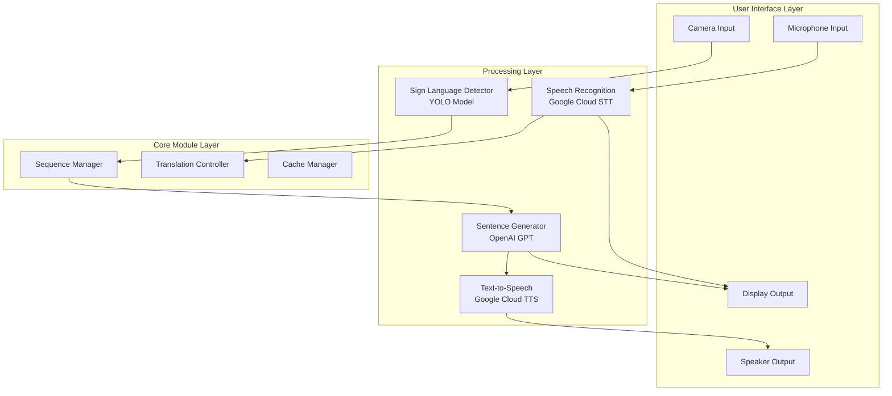

# 🤟 Sign Language Assistant
> **Real-time Bidirectional Sign Language Translation System**

<div align="center">


</div>

---

## 📌 Overview

농인과 청인 간의 소통 장벽을 해소하기 위한 **실시간 양방향 번역 시스템**입니다. 
최신 AI 기술을 활용하여 수어를 음성으로, 음성을 텍스트로 실시간 변환합니다.

### ✨ Key Features

<div align="center">
<table>
<tr>
<td width="55%">

#### 🎥 **수어 → 음성/텍스트**
- YOLO 기반 실시간 수어 인식
- 시퀀스 단어 자동 조합
- 자연스러운 문장 생성 (GPT)
- TTS 음성 출력

</td>
<td width="45%">

#### 🎤 **음성 → 텍스트**
- Google Cloud STT 활용
- 실시간 음성 인식
- 노이즈 필터링
- 한국어 최적화

</td>
</tr>
</table>
</div>

### 🎯 Project Goals

<div align="center">

| 목표 | 설명 | 상태 |
|:---:|:---|:---:|
| **실시간 수어 인식** | YOLO 모델을 통한 즉각적인 수어 감지 | ✅ **완료** |
| **자연스러운 문장 변환** | GPT를 활용한 문법적으로 올바른 문장 생성 | ✅ **완료** |
| **사용하기 쉬운 인터페이스** | 직관적인 UI/UX 디자인 | ✅ **완료** |


</div>

---

## 🏗️ System Architecture

### High-Level Design



### 📁 Project Structure

```
sign-assistant/
│
├── 📄 main.py                    # 프로그램 시작점
├── 📋 requirements.txt           # 필수 패키지 목록
├── 🔐 .env                      # API 키 설정 파일
├── 🔑 google-credentials.json   # Google Cloud 인증 파일
│
├── 📦 modules/                  # 핵심 모듈
│   ├── app_controller.py        # 애플리케이션 제어
│   ├── config.py                # 환경 설정
│   │
│   ├── 🖼️ ui/                  # 사용자 인터페이스
│   │   ├── main_window.py      
│   │   └── components.py       
│   │
│   ├── 🧠 core/                # 핵심 기능
│   │   ├── sequence_manager.py # 시퀀스 단어 관리
│   │   ├── sign_detector.py    # 수어 감지
│   │   ├── camera_handler.py   # 카메라 처리
│   │   └── workers.py          # 백그라운드 작업
│   │
│   └── 🗣️ translation/         # 번역 모듈
│       ├── main_translator.py  
│       ├── sentence_generator.py 
│       ├── tts_module.py       
│       └── stt_module.py       
│
├── 🤖 models/                   # AI 모델
│   └── best_1.pt               # 학습된 YOLO 모델
│
├── 🎓 model_train/              # 모델 학습
│   └── model.py                # YOLO 모델 학습 코드
│
├── 💾 cache/                    # 캐시 저장소
│   ├── tts_audio/              # TTS 오디오 캐시
│   └── sentence_cache.json     # 문장 생성 캐시
│
└── 📊 logs/                     # 로그 파일
```

---

## 🚀 Quick Start

### Prerequisites

<details>
<summary><b>System Requirements</b></summary>

- **OS**: Windows 10+, macOS 10.14+, Ubuntu 20.04+
- **Python**: 3.8 or higher
- **RAM**: Minimum 4GB (8GB recommended)
- **Storage**: 2GB free space
- **Camera**: USB webcam or built-in camera
- **Microphone**: Required for speech recognition

</details>

<details>
<summary><b>API Keys Required</b></summary>

1. **OpenAI API Key** - [Get it here](https://platform.openai.com/api-keys)
2. **Google Cloud Credentials** - [Setup guide](https://cloud.google.com/docs/authentication)
   - Enable Text-to-Speech API
   - Enable Speech-to-Text API

</details>

### Installation

#### 1️⃣ Clone the repository
```bash
git clone https://github.com/HyunBeen96/sign-assistant.git
cd sign-assistant
```

#### 2️⃣ Create virtual environment
```bash
# Windows
python -m venv venv
venv\Scripts\activate

# macOS/Linux
python3 -m venv venv
source venv/bin/activate
```

#### 3️⃣ Install dependencies
```bash
# Install required packages
pip install -r requirements.txt

# For macOS users (install portaudio first)
brew install portaudio

# For Ubuntu users
sudo apt-get install portaudio19-dev python3-pyaudio
```

#### 4️⃣ Configure environment
```bash
# Copy example environment file
cp .env.example .env

# Edit .env file with your API keys
# OPENAI_API_KEY=your_openai_api_key
# GOOGLE_APPLICATION_CREDENTIALS=path/to/google-credentials.json
```

#### 5️⃣ Download YOLO model
```bash
# Create models directory
mkdir models

# Download the model (링크 제공 예정)
# Place best_1.pt in models/ directory
```

---

## 💻 Usage

### Basic Usage

```bash
# Run the application
python main.py

# Run with options
python main.py --debug              # Debug mode
python main.py --no-camera          # Without camera
python main.py --log-level DEBUG    # Detailed logging
```

### Features Guide

<details>
<summary><b>🤟 Sign Language Mode</b></summary>

1. Click **"수어하기"** button to start
2. Position yourself in the green guide box
3. Perform sign language gestures
4. System recognizes and accumulates words
5. Click **"수어 그만하기"** to generate sentence
6. Generated sentence will be spoken via TTS

**Supported Gestures:**
- Single words: 학교, 병원, 아프다, 가다, 나, 빨리, 구조
- Sequence words: 구급차(3 steps), 쓰러지다(2 steps), 사람(2 steps)
- Special: 리셋 (delete last word)

</details>

<details>
<summary><b>🎤 Speech Mode</b></summary>

1. Click **"말하기"** button to start recording
2. Speak clearly into the microphone
3. Click **"말 그만하기"** to stop and convert
4. Recognized text appears on screen

</details>

### 📸 Screenshots

<div align="center">
<table>
<tr>
<td align="center">

<br><b>Main Interface</b>
</td>
<td align="center">

<br><b>Sign Language Detection</b>
</td>
</tr>
<tr>
<td align="center">

<br><b>Speech Recognition</b>
</td>
<td align="center">

<br><b>Translation Result</b>
</td>
</tr>
</table>
</div>

---

## 🎥 Demo

<div align="center">

### 📺 Video Demonstration

[](https://www.youtube.com/watch?v=[YouTube_ID])

*Click to watch the demo video*

### 🎬 Usage Scenarios

| Scenario | Description | Status |
|:---:|:---|:---:|
| 🏥 **Hospital** | Patient-Doctor communication | ✅ Tested |
| 🏪 **Store** | Customer service interaction | ✅ Tested |
| 🏛️ **Government Office** | Civil service assistance | 🔄 Testing |
| 🚌 **Public Transport** | Travel assistance | 📋 Planned |

</div>

---

## 🔧 Development

### Project Status

<div align="center">

| Module | Progress | Description |
|:---|:---:|:---|
| **Sign Detection** |  | YOLO model trained |
| **Sequence Management** |  | Complete |
| **Sentence Generation** |  | GPT integration |
| **TTS/STT** |  | Google Cloud APIs |
| **UI/UX** |  | PyQt5 interface |

</div>

### Tech Stack

<div align="center">

| Category | Technologies |
|:---:|:---|
| **Language** |  |
| **UI Framework** |  |
| **AI/ML** |   |
| **Cloud Services** |  |
| **Computer Vision** |  |

</div>

### Running Tests

```bash
# Run all tests
pytest

# Run with coverage
pytest --cov=modules tests/

# Run specific test
pytest tests/test_sequence_manager.py
```

### Code Style

```bash
# Format code
black modules/

# Check code style
flake8 modules/

# Type checking
mypy modules/
```

---

## 📊 Performance

### Benchmarks

| Metric | Target | Current | Status |
|:---|:---:|:---:|:---:|
| **Sign Recognition Accuracy** | 90% | 87% | 🟡 |
| **Response Time** | <2s | 1.5s | ✅ |
| **Memory Usage** | <500MB | 420MB | ✅ |
| **FPS (Camera)** | 30fps | 25fps | 🟡 |
| **TTS Latency** | <500ms | 300ms | ✅ |

### Optimization Tips

- Use GPU acceleration for YOLO model
- Enable caching for frequently used translations
- Adjust camera resolution based on performance
- Use lightweight TTS voices for faster response

---

## 🤝 Contributing

우리는 모든 기여를 환영합니다! 

### How to Contribute

1. Fork the repository
2. Create your feature branch (`git checkout -b feature/AmazingFeature`)
3. Commit your changes (`git commit -m 'Add some AmazingFeature'`)
4. Push to the branch (`git push origin feature/AmazingFeature`)
5. Open a Pull Request

### Development Setup

```bash
# Clone your fork
git clone https://github.com/your-username/sign-assistant.git

# Install development dependencies
pip install -r requirements-dev.txt

# Run in development mode
python main.py --debug
```

---

## 📝 Documentation

- [📖 User Manual](docs/USER_MANUAL.md)
- [🔧 API Documentation](docs/API.md)
- [🏗️ Architecture Guide](docs/ARCHITECTURE.md)
- [🚀 Deployment Guide](docs/DEPLOYMENT.md)

---

## 🐛 Troubleshooting

<details>
<summary><b>Common Issues</b></summary>

### Camera not detected
```bash
# Check camera availability
python -c "import cv2; print(cv2.VideoCapture(0).isOpened())"
```

### PyAudio installation failed
```bash
# Windows
pip install pipwin
pipwin install pyaudio

# macOS
brew install portaudio
pip install pyaudio

# Linux
sudo apt-get install portaudio19-dev
pip install pyaudio
```

### Google Cloud authentication error
```bash
# Set environment variable
export GOOGLE_APPLICATION_CREDENTIALS="path/to/credentials.json"
```

</details>

---

## 📜 License

This project is licensed under the MIT License - see the [LICENSE](LICENSE) file for details.

---

## 👥 Team

<div align="center">

| Role | Name | GitHub | Contact |
|:---:|:---:|:---:|:---:|
| **Project Lead** | HyunBeen | [@HyunBeen96](https://github.com/HyunBeen96) | [email] |
| **AI/ML Developer** | - | - | - |
| **UI/UX Developer** | - | - | - |
| **Backend Developer** | - | - | - |

</div>

---

## 🙏 Acknowledgments

- [Ultralytics](https://github.com/ultralytics/ultralytics) for YOLO implementation
- [OpenAI](https://openai.com/) for GPT API
- [Google Cloud](https://cloud.google.com/) for TTS/STT services
- Korean Sign Language Dataset providers
- All contributors and testers

---

## 📮 Contact

- **Project Issues**: [GitHub Issues](https://github.com/HyunBeen96/sign-assistant/issues)
- **Email**: your-email@example.com
- **Project Link**: [https://github.com/HyunBeen96/sign-assistant](https://github.com/HyunBeen96/sign-assistant)

---

<div align="center">

### 🌟 Star History

[](https://star-history.com/#HyunBeen96/sign-assistant&Date)

**If you find this project useful, please consider giving it a star ⭐**

<br>

Made with ❤️ by Sign Language Assistant Team

</div>
