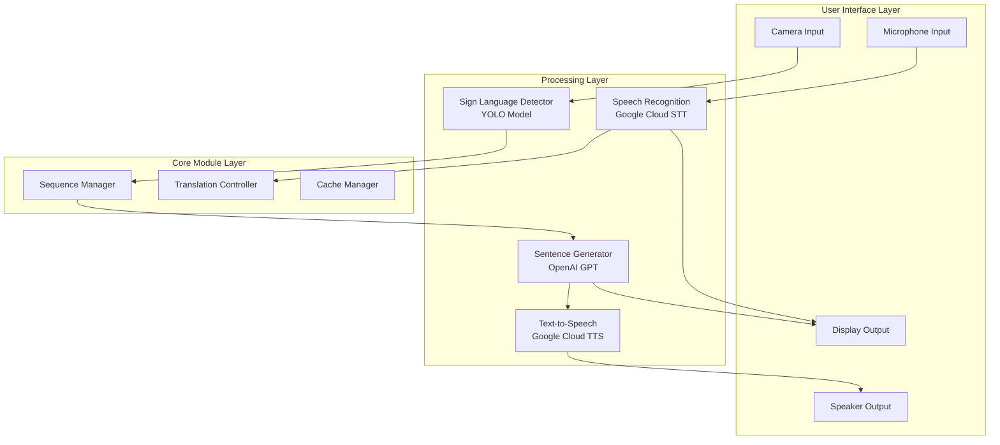

# 🤟 Sign Language Assistant
> **Real-time Bidirectional Sign Language Translation System**
---

## 🎥 Demo

### 시나리오

**대화 예시:**
1. 👨 청인: (마이크로) "어디에 가세요?"
2. 🧏 농인: (수어로) [나] + [학교] + [가다]
3. 🔊 시스템: "저는 학교에 갑니다." (음성 출력)

<div align="center">
<a href="https://youtu.be/PkTpwYJMkK0">
  
</a>
</div>
<div align="center">
*클릭하면 데모 영상을 볼 수 있습니다*
</div>


<div align="center">


</div>

---

## 📌 Overview

농인과 청인 간의 소통 장벽을 해소하기 위한 **실시간 양방향 번역 시스템**입니다. 
최신 AI 기술을 활용하여 수어를 음성으로, 음성을 텍스트로 실시간 변환합니다.

### ✨ Key Features

<div align="center">
<table>
<tr>
<td width="50%">

#### 🎥 **수어 → 음성/텍스트**
- YOLO 기반 실시간 수어 인식
- 시퀀스 단어 자동 조합
- 자연스러운 문장 생성 (GPT)
- TTS 음성 출력

</td>
<td width="50%">

#### 🎤 **음성 → 텍스트**
- Google Cloud STT 활용
- 실시간 음성 인식
- 노이즈 필터링
- 한국어 최적화

</td>
</tr>
</table>
</div>

### 🎯 Project Goals

<div align="center">

| 목표 | 설명 | 상태 |
|:---:|:---|:---:|
| **실시간 수어 인식** | YOLO 모델을 통한 즉각적인 수어 감지 | ✅ **완료** |
| **자연스러운 문장 변환** | GPT를 활용한 문법적으로 올바른 문장 생성 | ✅ **완료** |
| **사용하기 쉬운 인터페이스** | 직관적인 UI/UX 디자인 | ✅ **완료** |

</div>

---

## 🏗️ System Architecture

### 전체 시스템 구조



### 📁 Project Structure

```
sign-assistant/
│
├── 📄 main.py                    # Application entry point
├── 📋 requirements.txt           # Package dependencies
├── 🔐 .env                      # API keys configuration
├── 🔑 google-credentials.json   # Google Cloud authentication
│
├── 📦 modules/                  # Core application modules
│   ├── app_controller.py        # Application controller & initialization
│   ├── config.py                # Environment configuration manager
│   │
│   ├── 🖼️ ui/                  # User interface components
│   │   ├── main_window.py      # Main application window
│   │   └── components.py       # Reusable UI components
│   │
│   ├── 🧠 core/                # Core functionality modules
│   │   ├── sequence_manager.py # Multi-step sign sequence handler
│   │   ├── sign_detector.py    # YOLO-based sign detection
│   │   ├── camera_handler.py   # Camera thread & frame processing
│   │   └── workers.py          # Background task workers
│   │
│   └── 🗣️ translation/         # Translation & speech modules
│       ├── main_translator.py  # Main translation coordinator
│       ├── sentence_generator.py # GPT-based sentence generation
│       ├── tts_module.py       # Google Text-to-Speech module
│       └── stt_module.py       # Google Speech-to-Text module
│
├── 🤖 models/                   # AI model files
│   └── best_1.pt               # Trained YOLO v8 model weights
│
├── 🎓 model_train/              # Model training workspace
│   └── model.py                # YOLO model training script
│
├── 💾 cache/                    # Performance cache storage
│   ├── tts_audio/              # TTS audio cache files
│   └── sentence_cache.json     # Sentence generation cache
│
└── 📊 logs/                     # Application log files
    └── sign_language_translator.log
```

---

## 🚀 Quick Start

### Prerequisites

#### System Requirements
- **OS**: Windows 10+, macOS 10.14+, Ubuntu 20.04+
- **Python**: 3.8 이상
- **RAM**: 최소 4GB (8GB 권장)
- **Storage**: 2GB 여유 공간
- **Camera**: USB 웹캠 또는 내장 카메라
- **Microphone**: 음성 인식용 마이크

### Installation

#### 1️⃣ 저장소 복제
```bash
git clone https://github.com/juntaek-oh/sign-assistant.git
cd sign-assistant
```

#### 2️⃣ 가상환경 생성 및 활성화
```bash
# Windows
python -m venv venv
venv\Scripts\activate

# macOS/Linux
python3 -m venv venv
source venv/bin/activate
```

#### 3️⃣ 필수 패키지 설치
```bash
pip install -r requirements.txt
```

<details>
<summary><b>⚠️ OS별 추가 설치사항</b></summary>

**macOS:**
```bash
# portaudio 먼저 설치
brew install portaudio
pip install pyaudio
```

**Ubuntu/Debian:**
```bash
sudo apt-get update
sudo apt-get install portaudio19-dev python3-pyaudio
```

**Windows에서 PyAudio 오류 시:**
```bash
# pipwin 사용
pip install pipwin
pipwin install pyaudio
```

</details>

#### 4️⃣ API 키 설정

##### OpenAI API 설정
1. [OpenAI Platform](https://platform.openai.com/api-keys)에서 API 키 발급
2. `.env` 파일 생성 및 키 입력:
```env
OPENAI_API_KEY=sk-proj-xxxxxxxxxxxxx
```

##### Google Cloud API 설정
1. [Google Cloud Console](https://console.cloud.google.com/) 접속
2. 새 프로젝트 생성 또는 기존 프로젝트 선택
3. 다음 API 활성화:
   - Cloud Text-to-Speech API
   - Cloud Speech-to-Text API
4. 서비스 계정 생성 및 JSON 키 다운로드
5. JSON 파일을 프로젝트 루트에 저장
6. `.env` 파일에 경로 추가:
```env
GOOGLE_APPLICATION_CREDENTIALS=./your-credentials-file.json
```

**전체 .env 파일 예시:**
```env
# OpenAI API Key
OPENAI_API_KEY=sk-proj-uqfF5mOsBKuT2vtpt...

# Google Cloud 인증 파일 경로 (상대경로 또는 절대경로)
GOOGLE_APPLICATION_CREDENTIALS=./infinite-ch754.json
```

#### 5️⃣ YOLO 모델 다운로드
```bash
# models 폴더가 없다면 생성
mkdir models

# 학습된 모델 파일(best_1.pt)을 models/ 폴더에 배치
# 모델 파일은 프로젝트 관리자에게 요청
```

---

## 💻 Usage

### 프로그램 실행

```bash
# 기본 실행
python main.py

# 디버그 모드
python main.py --debug

# 상세 로그 출력
python main.py --log-level DEBUG
```

### 주요 기능 사용법

#### 🤟 수어 인식 모드

1. **"수어하기"** 버튼 클릭
2. 카메라 화면의 초록색 가이드 박스 안에서 수어 동작
3. 인식된 단어들이 자동으로 누적됨
4. **"수어 그만하기"** 버튼 클릭하여 문장 생성
5. 생성된 문장이 음성으로 출력됨


#### 🎤 음성 인식 모드

1. **"말하기"** 버튼 클릭
2. 마이크에 대고 명확하게 발화
3. **"말 그만하기"** 버튼 클릭
4. 인식된 텍스트가 화면에 표시됨

### 🤟 현재 모델에서 인식 가능한 수어 단어
<details>
<summary><b>📋 지원 단어 목록 (총 15개)</b></summary>


### 🔄 시퀀스 단어 (순서대로 동작 필요)
#### 🚑 구급차 (Ambulance) - 3단계 시퀀스
| 단계 | 동작명 | 수어 이미지 | 설명 |
|:---:|:---:|:---:|:---|
| 1/3 | 구급차1/3 |  | 첫 번째 동작 |
| 2/3 | 구급차2/3 |  | 두 번째 동작 |
| 3/3 | 구급차3/3 |  | 완성 동작 |
> **💡 완성 조건:** 1/3 → 2/3 → 3/3 순서대로 모두 인식되어야 "구급차" 단어 완성


#### 😵 쓰러지다 (Collapse) - 2단계 시퀀스
| 단계 | 동작명 | 수어 이미지 | 설명 |
|:---:|:---:|:---:|:---|
| 1/2 | 쓰러지다1/2 |  | 첫 번째 동작 |
| 2/2 | 쓰러지다2/2 |  | 완성 동작 |
> **💡 완성 조건:** 1/2 → 2/2 순서대로 인식되어야 "쓰러지다" 단어 완성


#### 👤 사람 (Person) - 2단계 시퀀스
| 단계 | 동작명 | 수어 이미지 | 설명 |
|:---:|:---:|:---:|:---|
| 1/2 | 사람1/2 |  | 첫 번째 동작 |
| 2/2 | 사람2/2 |  | 완성 동작 |
> **💡 완성 조건:** 1/2 → 2/2 순서대로 인식되어야 "사람" 단어 완성


### ⚡ 단일 동작 단어 (한 번에 인식)
| 단어 | 영어 | 수어 이미지 | 설명 |
|:---:|:---:|:---:|:---|
| **🏫 학교** | school |  | 학교를 나타내는 수어 |
| **😷 아프다** | hurt |  | 아픈 상태를 표현하는 수어 |
| **🚶 가다** | go |  | 이동을 나타내는 수어 |
| **👆 나** | me |  | 자신을 가리키는 수어 |
| **⚡ 빨리** | quickly |  | 빠른 속도를 나타내는 수어 |
| **🏥 병원** | hospital |  | 병원을 나타내는 수어 |
| **🆘 구조** | rescue |  | 도움 요청을 나타내는 수어 |


### 🔧 특수 기능
#### 🔄 리셋 (Reset)
| 기능 | 수어 이미지 | 동작 결과 |
|:---:|:---:|:---|
| **리셋** |  | 마지막에 입력된 단어 하나를 삭제합니다 |


### 📖 사용법 안내

**🔄 시퀀스 단어:**
- **구급차**: 1/3 → 2/3 → 3/3 순서대로 동작해야 완성
- **쓰러지다**: 1/2 → 2/2 순서대로 동작해야 완성  
- **사람**: 1/2 → 2/2 순서대로 동작해야 완성

**⚡ 단일 동작:**
- 한 번의 수어 동작으로 바로 인식

**🔧 특수 기능:**
- **리셋**: 마지막에 입력된 단어 하나를 삭제

### 💡 팁
- 시퀀스 단어는 순서를 지켜야 합니다
- 중간에 다른 단어가 들어와도 시퀀스는 계속 진행됩니다
- 10초 동안 다음 단계가 없으면 시퀀스가 초기화됩니다

---
---
---
</details>

---

## 🔧 Development

### 모델 학습

YOLO 모델을 직접 학습시키려면:

```bash
cd model_train
python model.py
```

학습에 필요한 데이터셋과 설정은 `model_train/` 폴더 내 문서를 참조하세요.

### 프로젝트 구조 설명

- **modules/**: 핵심 기능 모듈
- **model_train/**: YOLO 모델 학습 코드
- **cache/**: 성능 향상을 위한 캐시 저장
- **logs/**: 디버깅용 로그 파일

---

## 🐛 Troubleshooting

### 자주 발생하는 문제

<details>
<summary><b>카메라가 인식되지 않을 때</b></summary>

```python
# 카메라 확인 코드
import cv2
cap = cv2.VideoCapture(0)
if cap.isOpened():
    print("카메라 정상")
else:
    print("카메라 오류")
cap.release()
```
</details>

<details>
<summary><b>Google API 인증 오류</b></summary>

1. JSON 파일 경로 확인
2. 환경변수 설정 확인:
```bash
echo $GOOGLE_APPLICATION_CREDENTIALS  # Linux/Mac
echo %GOOGLE_APPLICATION_CREDENTIALS%  # Windows
```
3. JSON 파일 권한 확인
</details>

<details>
<summary><b>PyAudio 설치 실패</b></summary>

**Windows:**
```bash
# Microsoft C++ Build Tools 설치 필요
# 또는 wheel 파일 직접 다운로드
pip install pipwin
pipwin install pyaudio
```

**macOS:**
```bash
brew install portaudio
pip install pyaudio
```
</details>

---

## 📜 License

This project is licensed under the MIT License - see the [LICENSE](LICENSE) file for details.

---

## 👥 Team

<div align="center">

| Role | Name | GitHub | Contact |
|:---:|:---:|:---:|:---:|
| **Project Lead & NLP Developer** | HyunBeen | [@HyunBeen96](https://github.com/HyunBeen96) | [kimm0620@naver.com] |
| **AI/ML Developer** | MinSung | [@LRkms](https://github.com/LRkms) | [some0506@naver.com] |
| **Hardware & UI Developer** | JunTaek | [@juntaek-oh](https://github.com/juntaek-oh) | [ojt8416@gmail.com] |
| **Data Analyst & Documentation** | HaeChan | [@JHC1023](https://github.com/JHC1023) | [chc961023@gmail.com] |

</div>

프로젝트 관련 문의: [GitHub Issues](https://github.com/HyunBeen96/sign-assistant/issues)

---

## 🙏 Acknowledgments

- [Ultralytics](https://github.com/ultralytics/ultralytics) - YOLO 구현
- [OpenAI](https://openai.com/) - GPT API 제공
- [Google Cloud](https://cloud.google.com/) - TTS/STT 서비스
- 한국 수어 데이터셋 제공자
- 모든 테스터와 기여자

---


</div>
